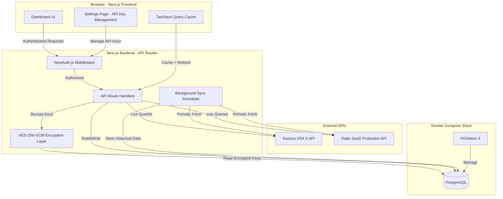
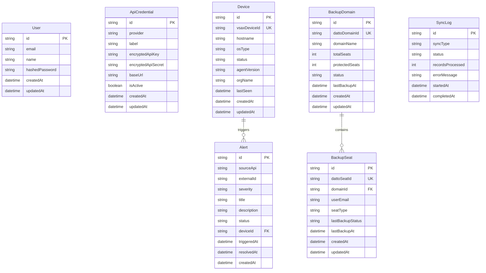
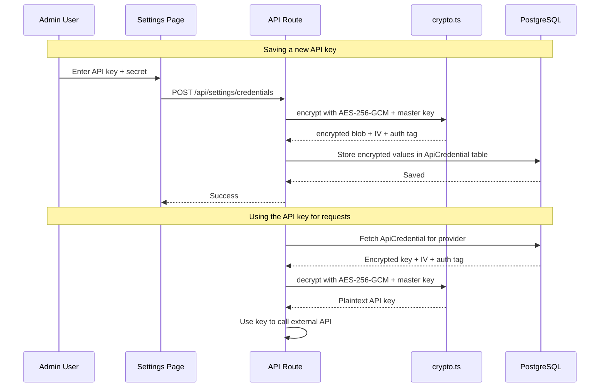
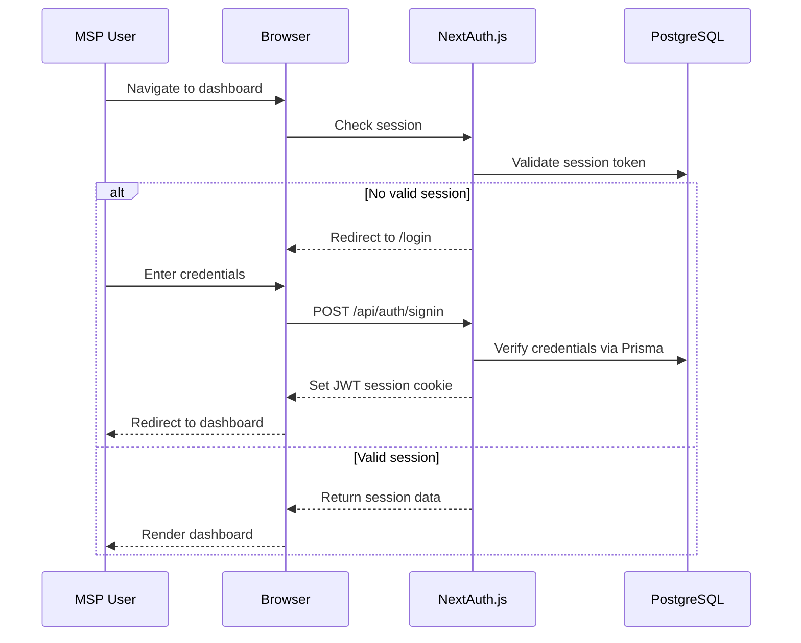
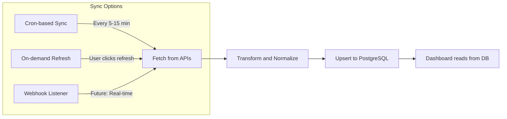

# MSP Dashboard — Architecture Plan

## Overview

A Next.js web application dashboard for internal MSP use that integrates **Kaseya VSA X** (RMM) and **Datto SaaS Protection** (Backup) APIs into a unified monitoring interface.

---

## Tech Stack

| Layer | Technology |
|---|---|
| Framework | Next.js 14+ (App Router) with TypeScript |
| Authentication | NextAuth.js (Credentials provider, JWT sessions) |
| Database | PostgreSQL (via Docker Compose) |
| DB Admin | PGAdmin 4 (via Docker Compose) |
| ORM | Prisma |
| Encryption | Node.js crypto (AES-256-GCM for API key encryption) |
| Styling | Tailwind CSS + shadcn/ui |
| Charts | Recharts or Tremor |
| HTTP Client | Axios or native fetch |
| Deployment | Docker Compose (app + PostgreSQL + PGAdmin) |
| State Management | React Query (TanStack Query) for server state |

---

## High-Level Architecture



---

## Project Structure

```
vsax-dashboard/
├── .env.local                   # Environment variables (master encryption key only)
├── .env.example                 # Template for env vars
├── docker-compose.yml           # Docker Compose: app + postgres + pgadmin
├── Dockerfile                   # Next.js container
├── next.config.ts               # Next.js configuration
├── tailwind.config.ts           # Tailwind CSS configuration
├── prisma/
│   ├── schema.prisma            # Database schema
│   ├── migrations/              # DB migrations
│   └── seed.ts                  # Seed script for initial admin user
├── src/
│   ├── app/
│   │   ├── layout.tsx           # Root layout with providers
│   │   ├── page.tsx             # Home/Overview dashboard
│   │   ├── login/
│   │   │   └── page.tsx         # Login page
│   │   ├── devices/
│   │   │   └── page.tsx         # Device monitoring page
│   │   ├── backups/
│   │   │   └── page.tsx         # Datto SaaS backup status
│   │   ├── alerts/
│   │   │   └── page.tsx         # Alerts page (VSA X alerts only)
│   │   ├── settings/
│   │   │   └── page.tsx         # Settings page (API key management)
│   │   └── api/
│   │       ├── auth/
│   │       │   └── [...nextauth]/
│   │       │       └── route.ts # NextAuth handler
│   │       ├── vsax/
│   │       │   ├── devices/
│   │       │   │   └── route.ts
│   │       │   └── alerts/
│   │       │       └── route.ts
│   │       ├── datto/
│   │       │   ├── domains/
│   │       │   │   └── route.ts
│   │       │   ├── seats/
│   │       │   │   └── route.ts
│   │       │   └── backup-status/
│   │       │       └── route.ts
│   │       ├── settings/
│   │       │   └── credentials/
│   │       │       └── route.ts # CRUD for API credentials
│   │       └── sync/
│   │           └── route.ts     # Manual sync trigger
│   ├── components/
│   │   ├── ui/                  # shadcn/ui components
│   │   ├── layout/
│   │   │   ├── Sidebar.tsx
│   │   │   ├── Header.tsx
│   │   │   └── DashboardShell.tsx
│   │   ├── devices/
│   │   │   ├── DeviceTable.tsx
│   │   │   ├── DeviceStatusCard.tsx
│   │   │   └── DeviceFilters.tsx
│   │   ├── backups/
│   │   │   ├── BackupStatusTable.tsx
│   │   │   ├── BackupSummaryCard.tsx
│   │   │   └── BackupTrendChart.tsx
│   │   ├── alerts/
│   │   │   └── AlertList.tsx
│   │   ├── settings/
│   │   │   ├── ApiKeyForm.tsx
│   │   │   └── ApiKeyList.tsx
│   │   └── dashboard/
│   │       ├── OverviewCards.tsx
│   │       ├── StatusSummary.tsx
│   │       └── RecentActivity.tsx
│   ├── lib/
│   │   ├── prisma.ts            # Prisma client singleton
│   │   ├── auth.ts              # NextAuth configuration
│   │   ├── crypto.ts            # AES-256-GCM encrypt/decrypt helpers
│   │   └── utils.ts             # Shared utilities
│   ├── services/
│   │   ├── vsax/
│   │   │   ├── client.ts        # VSA X API client class
│   │   │   ├── types.ts         # VSA X type definitions
│   │   │   └── endpoints.ts     # Endpoint constants
│   │   ├── datto/
│   │   │   ├── client.ts        # Datto SaaS API client class
│   │   │   ├── types.ts         # Datto type definitions
│   │   │   └── endpoints.ts     # Endpoint constants
│   │   └── credentials.ts       # Service to fetch + decrypt API keys from DB
│   ├── hooks/
│   │   ├── useDevices.ts        # Device data hook
│   │   ├── useBackups.ts        # Backup data hook
│   │   └── useAlerts.ts         # Alerts data hook
│   └── types/
│       └── index.ts             # Shared application types
└── README.md
```

---

## Database Schema (Prisma)



> **Note**: Tickets have been intentionally excluded from Phase 1. A separate API integration for ticketing will be added in a future phase.

---

## API Key Encryption Strategy

API keys are stored **encrypted** in PostgreSQL (not hashed — the app needs to read them back to make API calls).

### How It Works



### Encryption Details

| Aspect | Value |
|---|---|
| Algorithm | AES-256-GCM |
| Key derivation | Master key from `ENCRYPTION_MASTER_KEY` env var |
| IV | Random 12-byte IV generated per encryption |
| Storage format | `iv:authTag:ciphertext` (base64 encoded) |
| Library | Node.js built-in `crypto` module |

### The `ApiCredential` Model

| Field | Purpose |
|---|---|
| `provider` | Identifier: `vsax`, `datto`, or future integrations |
| `label` | Human-readable name, e.g. "Production VSA X" |
| `encryptedApiKey` | AES-256-GCM encrypted API key |
| `encryptedApiSecret` | AES-256-GCM encrypted API secret (nullable, for Datto) |
| `baseUrl` | API base URL for this provider |
| `isActive` | Toggle to enable/disable without deleting |

### Settings UI Features

- Add new API credentials for any provider
- View existing credentials (keys shown as masked `****...last4`)
- Test connection button (validates key against the API)
- Enable/disable credentials without deleting
- Delete credentials
- Only accessible to authenticated admin users

---

## API Integration Details

### Kaseya VSA X API

| Endpoint Purpose | Likely Endpoint Pattern | Dashboard Usage |
|---|---|---|
| List devices/agents | `GET /api/v1/agents` | Device monitoring table |
| Device details | `GET /api/v1/agents/{id}` | Device detail view |
| Alerts | `GET /api/v1/alerts` | Alerts dashboard |
| Organizations | `GET /api/v1/organizations` | Filtering by org |

**Auth method**: API Key (typically passed as `Authorization: Bearer <token>` or custom header)

> **Note**: Verify exact endpoints against your VSA X API documentation. The endpoints above are representative patterns.

### Datto SaaS Protection API

| Endpoint Purpose | Endpoint Pattern | Dashboard Usage |
|---|---|---|
| List domains | `GET /v1/saas/domains` | Backup domain overview |
| Domain details | `GET /v1/saas/domains/{id}` | Domain drill-down |
| List seats | `GET /v1/saas/domains/{id}/seats` | Per-user backup status |
| Backup history | `GET /v1/saas/domains/{id}/seats/{id}/backups` | Backup trend chart |
| Bulk seat status | `GET /v1/saas/domains/{id}/seats/bulkSeatStatus` | Summary cards |

**Auth method**: HTTP Basic Auth with API key as username and secret key as password, or `Authorization: Bearer <token>`

> **Note**: Verify exact endpoints against [Datto API documentation](https://portal.dattobackup.com/integrations/api).

---

## Authentication Flow



**NextAuth.js Configuration:**
- Provider: **Credentials** (email + password against PostgreSQL via Prisma)
- Session strategy: **JWT** (stateless, good for Docker)
- Password hashing: **bcrypt**
- Initial admin user created via **Prisma seed script**
- Optional future enhancement: Add OIDC/SAML for SSO

---

## Data Sync Strategy



**Phase 1**: Use **TanStack Query** for real-time API calls + cache, and a **cron-like scheduler** (e.g., `node-cron` in a custom server or Vercel Cron) to periodically sync data into PostgreSQL for historical tracking.

**Phase 2**: Add webhook listeners if APIs support them for real-time updates.

---

## Docker Compose Setup

The entire stack runs via `docker-compose up`:

```yaml
# docker-compose.yml
version: "3.9"

services:
  app:
    build: .
    container_name: mspdashboard-app
    ports:
      - "3000:3000"
    depends_on:
      db:
        condition: service_healthy
    env_file:
      - .env.local
    environment:
      DATABASE_URL: postgresql://mspdash:mspdash_secret@db:5432/mspdashboard
    restart: unless-stopped

  db:
    image: postgres:16-alpine
    container_name: mspdashboard-db
    volumes:
      - pgdata:/var/lib/postgresql/data
    environment:
      POSTGRES_DB: mspdashboard
      POSTGRES_USER: mspdash
      POSTGRES_PASSWORD: mspdash_secret
    ports:
      - "5432:5432"
    healthcheck:
      test: ["CMD-SHELL", "pg_isready -U mspdash -d mspdashboard"]
      interval: 10s
      timeout: 5s
      retries: 5
    restart: unless-stopped

  pgadmin:
    image: dpage/pgadmin4:latest
    container_name: mspdashboard-pgadmin
    ports:
      - "5050:80"
    environment:
      PGADMIN_DEFAULT_EMAIL: admin@mspdashboard.local
      PGADMIN_DEFAULT_PASSWORD: pgadmin_secret
    depends_on:
      db:
        condition: service_healthy
    volumes:
      - pgadmin_data:/var/lib/pgadmin
    restart: unless-stopped

volumes:
  pgdata:
  pgadmin_data:
```

**Access Points:**
| Service | URL | Credentials |
|---|---|---|
| Dashboard App | `http://localhost:3000` | NextAuth login |
| PGAdmin | `http://localhost:5050` | `admin@mspdashboard.local` / `pgadmin_secret` |
| PostgreSQL | `localhost:5432` | `mspdash` / `mspdash_secret` |

> When adding the PostgreSQL server in PGAdmin, use hostname `db` (the Docker service name) instead of `localhost`.

---

## Dashboard Pages

### 1. Overview (Home)
- Total devices online/offline count (VSA X)
- Backup success/failure summary (Datto)
- Active alerts count by severity
- Recent activity feed

### 2. Device Monitoring
- Searchable, filterable device table
- Columns: hostname, OS, status, last seen, org, agent version
- Click-to-expand detail panel
- Status indicators (online/offline/warning)

### 3. Backup Status
- Domain-level summary cards
- Per-seat backup status table
- Last backup timestamp and status
- Backup success rate trend chart (historical from DB)

### 4. Alerts
- Alert feed from VSA X
- Filter by severity, status, date range
- Link alerts to related devices
- Alert count badges by severity

### 5. Settings
- API credential management (add, edit, delete, test connection)
- Masked key display (show only last 4 characters)
- Enable/disable credentials toggle
- Provider selection (VSA X, Datto, future integrations)

> **Note**: Tickets are intentionally excluded from Phase 1. A separate ticketing API integration will be added in a future phase.

---

## Environment Variables

```bash
# Application
NEXTAUTH_URL=http://localhost:3000
NEXTAUTH_SECRET=<generate-with-openssl-rand-base64-32>

# Encryption (for API keys stored in DB)
ENCRYPTION_MASTER_KEY=<generate-with-openssl-rand-hex-32>

# Database (matches Docker Compose config)
DATABASE_URL=postgresql://mspdash:mspdash_secret@db:5432/mspdashboard

# Seed admin user (used by prisma seed script only)
ADMIN_EMAIL=admin@yourdomain.com
ADMIN_PASSWORD=<initial-admin-password>
```

> **Note**: API keys for VSA X and Datto are NO LONGER stored in env vars. They are managed through the Settings UI and stored encrypted in PostgreSQL. Only the `ENCRYPTION_MASTER_KEY` (used to encrypt/decrypt those keys) lives in the env file.

---

## Implementation Order

The steps below represent the recommended build sequence:

1. **Project Scaffolding** — Initialize Next.js + TypeScript, install dependencies
2. **Docker Compose** — Set up `docker-compose.yml` with app, PostgreSQL, and PGAdmin; verify connectivity
3. **Prisma Schema + Migrations** — Define models (User, ApiCredential, Device, BackupDomain, BackupSeat, Alert, SyncLog), run initial migration
4. **Prisma Seed Script** — Create initial admin user with hashed password
5. **Encryption Utilities** — Build `crypto.ts` with AES-256-GCM encrypt/decrypt functions
6. **NextAuth.js** — Configure credentials provider, JWT sessions, protect routes
7. **Settings API + UI** — CRUD for API credentials with encryption, test connection feature
8. **API Service Layer** — Build VSA X and Datto SaaS API client classes that read keys from DB
9. **API Routes** — Create Next.js route handlers that proxy to external APIs
10. **Dashboard Shell** — Sidebar, header, layout with navigation
11. **Overview Page** — Summary widgets pulling from both APIs
12. **Device Monitoring Page** — Table, filters, status cards
13. **Backup Status Page** — Domain cards, seat table, trend charts
14. **Alerts Page** — Alert feed with severity filters and device linking
15. **Background Sync** — Cron scheduler for historical data ingestion into PostgreSQL
16. **Polish** — Error handling, loading skeletons, toast notifications
17. **Documentation** — README, `.env.example` template, deployment guide

---

## Key Dependencies

```json
{
  "dependencies": {
    "next": "^14.x",
    "react": "^18.x",
    "typescript": "^5.x",
    "next-auth": "^4.x",
    "@prisma/client": "^5.x",
    "@tanstack/react-query": "^5.x",
    "tailwindcss": "^3.x",
    "axios": "^1.x",
    "recharts": "^2.x",
    "bcrypt": "^5.x",
    "lucide-react": "latest",
    "class-variance-authority": "latest",
    "clsx": "latest",
    "tailwind-merge": "latest"
  },
  "devDependencies": {
    "prisma": "^5.x",
    "@types/node": "^20.x",
    "@types/react": "^18.x",
    "@types/bcrypt": "^5.x",
    "eslint": "^8.x",
    "eslint-config-next": "^14.x",
    "ts-node": "^10.x"
  }
}
```

> **shadcn/ui** components will be added via the `npx shadcn-ui@latest init` CLI and individual component installs.

---

## Future Enhancements (Out of Scope for Phase 1)

- **Ticketing integration** — Separate API for a different ticketing application
- Role-based access control (admin vs. read-only)
- SSO integration via OIDC/SAML
- Webhook-based real-time updates
- Email/Slack alert notifications
- Multi-tenant support for multiple MSP clients
- PDF report generation and export
- Dark mode toggle
- API key rotation reminders/expiry tracking
